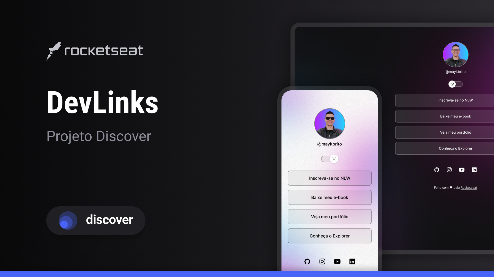

<h1 align = "center"> DevLinks</h1>

 Evento excluisivo e gratuito, promovido pela Rocketseat para ensino de tecnologias WEB.

 
<a href="#-tecnologias">Tecnologias</a>&nbsp;&nbsp;&nbsp;|&nbsp;&nbsp;&nbsp;
<a href="#=projeto">Projeto</a>&nbsp;&nbsp;&nbsp;|&nbsp;&nbsp;&nbsp;
<a href="#-layout">Layout</a>

 

## 🚀 Tecnologias

Esse projeto foi desenvolvido com as seguintes tecnologias:

- HTML e CSS
- JavaScript
- GIt e Github
- FIgma

## 💻 Projeto

O DevLinks é um agregador de links para usar como cartão de visitas online.

## 📑 Layout

VOcê pode visualizar o layout do projeto através [DESSE LINK](https://www.figma.com/design/2aLjO2wMUFBsNPIcLgaFIt/DevLinks-%E2%80%A2-Projeto-Discover-(Community)?node-id=10-620&p=f&t=QTY0XfqYMXW4OBjE-0). É necessário ter conta no [Figma](https://figma.com) para acessá-lo.